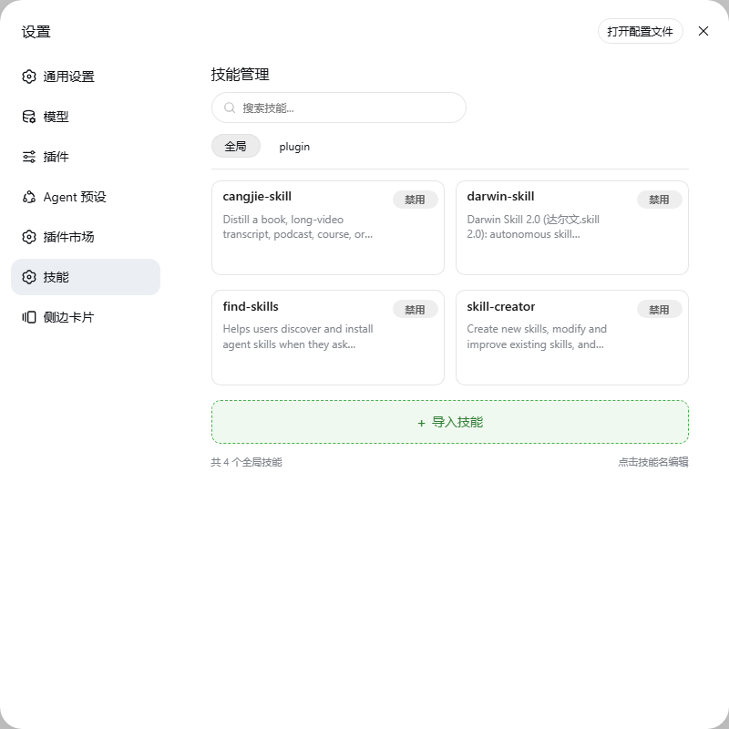

# dsh-skill-manager

DSH 设置界面中的**技能管理器**插件。在设置页新增【技能】入口，可视化管理全局与项目级 Skill（基于 deepseek-harness 的 `SKILL.md` 目录结构）。



## 功能

- 设置页左侧导航栏新增【技能】入口
- **全局 / 工作区** tab 切换（工作区列表从 DSH 配置动态读取）
- 技能卡片：两列网格、名称可点击编辑、描述两行截断
- **导入技能**：调用系统文件夹选择器，完整复制整个 Skill 目录（含子目录）到目标目录
- **编辑技能**：直接编辑完整 `SKILL.md`（frontmatter + 正文）
- **删除技能**：删除整个 Skill 目录
- **启用 / 禁用**：通过重命名目录加 `.disabled` 后缀实现（DSH 自动忽略，真正失效）
- 全局目录：`~/.dsh/skills/`；项目目录：`<workspace>/.dsh/skills/`

## 安装

### 从 GitHub 安装（推荐）

```
dsh plugin add https://github.com/KeyboardPrince/dsh-skill-manager
```

> 提示：git 源安装会执行仓库的 `prepare` 脚本；pnpm ≥10 可能需要你授权 `allowBuilds`。

### 从本地目录安装

```bash
# 克隆仓库
git clone https://github.com/KeyboardPrince/dsh-skill-manager.git
# 安装到指定 profile
dsh plugin --profile web add ./dsh-skill-manager
```

### 从 npm registry 安装（如已发布）

```
dsh plugin --profile web add dsh-skill-manager@latest
```

若插件以其他包名发布，替换为实际包名即可。

## 卸载

```bash
# 从当前 profile 移除插件
dsh plugin --profile web remove dsh-skill-manager

# 如需彻底删除已写入的指令文件（可选）
rm ~/.dsh/Agents.md
rm <workspace>/.dsh/Agents.md
```

卸载插件不会自动删除你已保存的 `Agents.md` 文件，避免误删自定义指令。

## 文件结构

```
dsh-skill-manager/
├── package.json          # 插件配置（含 dsh.bundle + dsh.client 声明）
├── cordis.patch.yml      # bundle 配置层
├── index.js              # Host half：API 路由与文件系统操作
├── client/
│   └── client.js         # Client half：React UI 组件
├── assets/
│   └── screenshot.png    # 截图
└── README.md
```

## API 路由

| 方法 | 路径 | 说明 |
|------|------|------|
| GET | `/skill/api/workspaces` | 获取工作区列表 |
| GET | `/skill/api/list?scope=global\|project&ws=<path>` | 获取技能列表 |
| POST | `/skill/api/import` | 导入技能（完整目录树） |
| POST | `/skill/api/update` | 更新完整的 SKILL.md 内容 |
| POST | `/skill/api/delete` | 删除技能目录 |
| POST | `/skill/api/toggle` | 启用 / 禁用（加 / 去 `.disabled` 后缀） |
| GET | `/skill/api/detail?scope=&ws=&id=` | 读取技能完整内容 |

## 技术说明

- **Host half**（`index.js`）：基于 Cordis 插件系统，注册 `settings.section` slot 注入导航项，提供 REST 风格的 API 路由，直接读写文件系统上的 `SKILL.md`。
- **Client half**（`client.js`）：通过 `dsh.client.inject` 注入 React 组件，使用 `React.createElement` 构建 UI（无打包步骤）。
- **禁用实现**：`skill-x` ⇄ `skill-x.disabled` 目录重命名，与 DSH 运行时扫描行为一致。
- 导入使用浏览器 File System Access API（`showDirectoryPicker`），递归读取整目录后由服务端完整还原。

## 许可证

MIT
